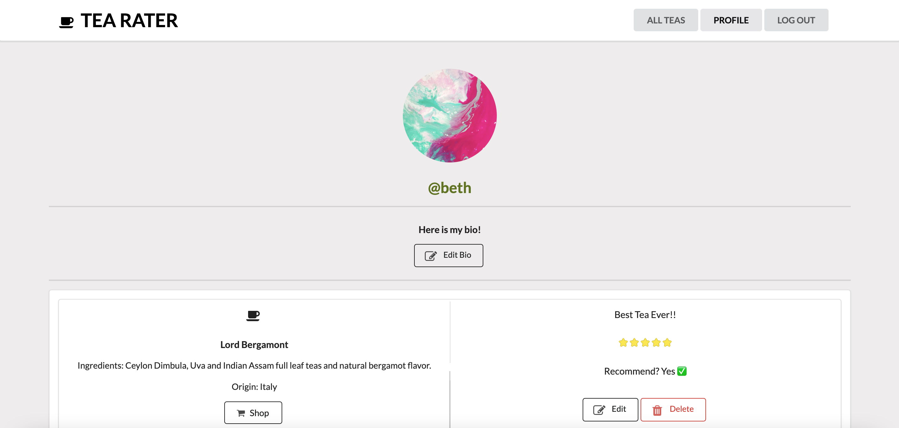

# Tea Rater
This application is used to leave and view reviews on a list of teas.

## Deployed App
https://tea-rater.herokuapp.com

## Front End
The front-end of the website is built using React. `npm start --prefix client` runs the app in the development mode. Open [http://localhost:4000](http://localhost:4000) to view it in the browser.

## Back End
The back-end of the website is built using Ruby on Rails. `rails db:create db:migrate db:seed` then run `rails s` to run the back-end of the app in the development mode. Open [http://localhost:3000](http://localhost:3000) to view it in the browser.

## User Stories
The application allows the user to 
  * Sign-up for an account
  * Login / logout of account
  * View all teas saved on the database
  * View details of tea like image, description, ingredients, and origin of tea
  * View origin of tea on a map
  * View all reviews left on tea by other users
  * Add a review on a tea 
  * Edit a review left on on a tea
  * Delete a review left on a tea
  * View profile details and all reviews left on different teas on one page
  * Edit their bio on profile page
  * Get routed to a shop to purchase the tea

## Styling
This application uses the following for styling
  * Semantic UI
  * Custom css
  * MapBox
  * Photos and tea details from https://www.smithtea.com/

## Login / SignUp Page

## Home Page after Login

## Search Feature (search by tea name)

## Detail Page for Specific Tea

## Map for Origin of Tea (interactive)

## Add Review Feature

## Profile Page / Edit Bio

## Edit / Delete Review Feature

## Error Handling - SignUp

## Error Handling - Login

## Author
Beth Fekadu
  * GitHub: https://github.com/8eth 
  * Linkedin: https://www.linkedin.com/in/beth-fekadu
